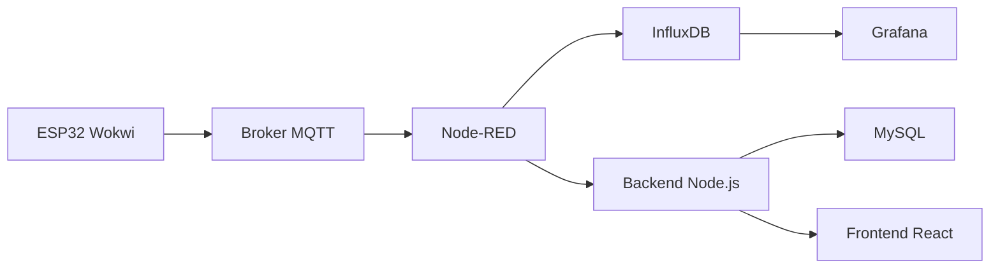

# Arquitetura da Solucao

## Tema escolhido

Monitoramento ambiental de uma estufa inteligente.

## Etapa 01 - Stack MING

- `ESP32 no Wokwi` simula sensores de temperatura, umidade, CO2 e luminosidade.
- `MQTT` recebe o payload JSON publicado pelo dispositivo.
- `Node-RED` valida e encaminha os dados.
- `InfluxDB` armazena as series temporais.
- `Grafana` exibe o painel operacional em tempo real.

## Etapa 02 - Camada Web

- `Backend Node.js` expone API REST e aplica as regras de negocio.
- `MySQL` persiste dados consolidados e agregados por janela.
- `Frontend React` mostra dados processados, indicadores e alertas.

## Regras de negocio implementadas

1. Media por periodo: media da ultima hora para temperatura, umidade e CO2.
2. Deteccao de anomalias: identifica leituras fora da faixa esperada.
3. Classificacao simples: `normal`, `alerta` e `critico`.
4. Consolidacao: janela de 5 minutos para reduzir granularidade.

## Fluxo end-to-end

